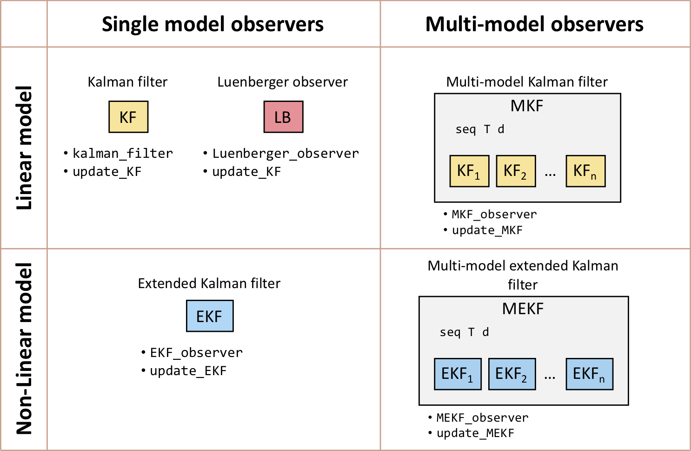
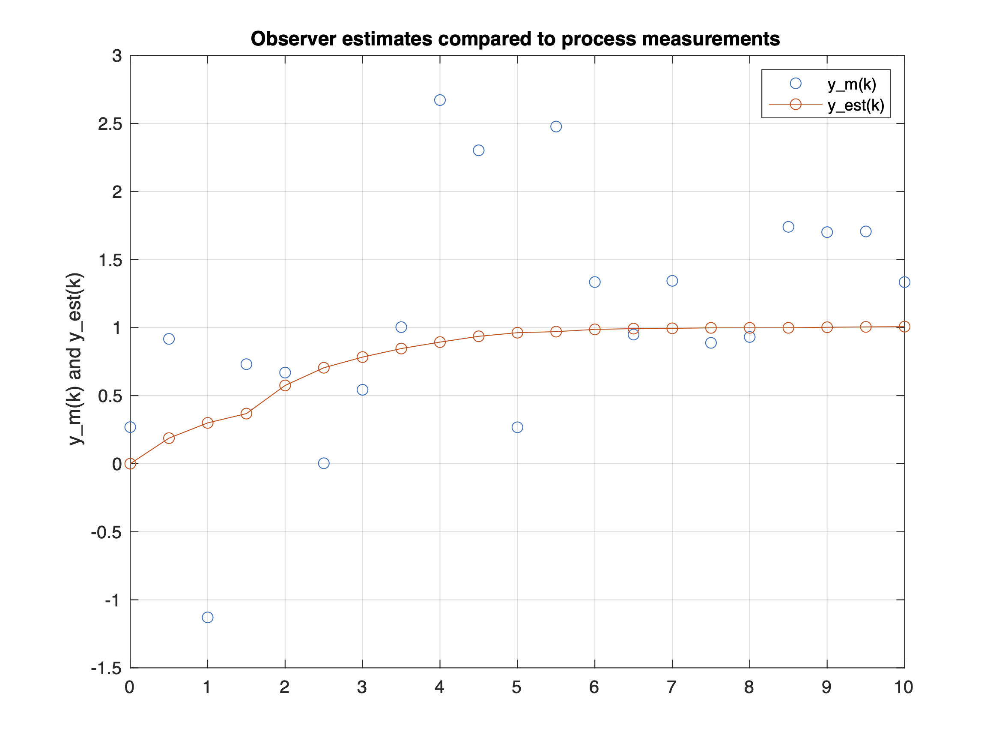

# process-observers

MATLAB scripts for simulating [process observers](https://en.wikipedia.org/wiki/State_observer) for online state estimation, including multiple-model observers suitable for estimating process with *infrequently-occuring*, *abrupt*, *unmeasured disturbances*.  

The observers are implemented as MATLAB objects (classes) with similar arguments, properties and methods. They are intended to be used for research purposes to evaluate and compare the behaviour of different multi-model observer algorithms.

For example, the following statement creates a [Kalman filter](https://en.wikipedia.org/wiki/Kalman_filter) object based on a linear model of a dynamical system:

```Matlab
KF1 = KalmanFilter(A,B,C,D,Ts,P0,Q,R,'KF1');
```

This object can then be used to iteratively simulate the Kalman filter:

```Matlab
% Array to store estimates
Y_est = nan(nT+1,1);

% Initial estimate (at t=0)
Y_est(1,:) = KF1.ykp1_est;

for i = 1:nT

    % Update observer with measurements at current sample time
    KF1.update(Ym(i), U(i));

    % Get estimate of output at next sample time
    Y_est(i+1,:) = KF1.ykp1_est;

end
```

The internal variables can easily be inspected at any point:
```Matlab
>> KF1

KF1 = 

  KalmanFilter with properties:

           Q: 0.0100
           R: 0.2500
          P0: 1000
           n: 1
          nu: 1
          ny: 1
           A: 0.7000
           B: 1
           C: 0.3000
           D: 0
          Ts: 0.5000
           K: 0.0162
           P: 0.0195
       label: "KF1"
          x0: 0
    xkp1_est: 3.3566
    ykp1_est: 1.0070
        type: "KF"

```

The observer objects can also be included in Simulink models using custom blocks provided in the example model file [MKF_example_sim.slx](MKF_example_sim.slx).


## List of contents

Observers currently included:
- [LuenbergerFilter.m](LuenbergerFilter.m) - Luenberger observer (with static correction gain) [[2]](#2).
- [KalmanFilter.m](KalmanFilter.m) - Kalman filter [[1]](#1).
- [KalmanFilterSS.m](KalmanFilterSS.m) - steady-state Kalman filter (with static correction gain).

General-purpose multi-model observer:
- [MKFObserver.m](MKFObserver.m) - multi-model Kalman filter observer.

Specialised multi-model observers:
- [MKFObserverSF.m](MKFObserverSF.m) - multi-model observer for state estimation in the presence of *randomly-occurring deterministic disturbances* (RODDs) as described in Robertson et al. [[3]](#3).
- [MKFObserverSP.m](MKFObserverSP.m) - multi-model observer for state estimation in the presence of *infreuently-occurring disturbances* with an adaptive sequence pruning multiple model algorithm described in Eriksson and Isaksson [[4]](#4).

There are also extended Kalman filter (EKF) versions — *these are currently still under development and not fully tested*:
- [EKF_observer.m](EKF_observer.m) - extended Kalman filter for non-linear systems.
- [MEKF_observer.m](MEKF_observer.m) - multi-model extended Kalman filter observer.
- [MEKF_observer_RODD.m](MEKF_observer_RODD.m) - multi-model observer as described in Robertson et al. [[3]](#3).
- [MEKF_observer_AFMM.m](MEKF_observer_AFMM.m) - multi-model observer as described in Eriksson and Isaksson [[4]](#4).

Simulink simulation tools:
- [KalmanFilter_sfunc.m](KalmanFilter_sfunc.m) - S-function for standard Kalman filter.
- [KalmanFilterSS_sfunc.m](KalmanFilterSS_sfunc.m) - S-function for steady-state Kalman filter.
- [MKFObserver_sfunc.m](MKFObserver_sfunc.m) - general-purpose S-function that works with all observer types.
- [MKF_example_sim.slx](MKF_example_sim.slx) - Simulink model file containing S-function blocks.


## Object hierarchy

<p align="center">
    
</p>


## Installation

Clone this repository to your local machine and either add the root to your MATLAB path or work within the main folder.


## Minimal example

Suppose you have some input-output measurement data from a process:
```Matlab
% Known inputs
U = [     0     0     1     1     1     1     1     1     1     1 ...
          1     1     1     1     1     1     1     1     1     1 ...
          1]';

% Output measurements
Ym =  [    0.2688    0.9169   -1.1294    0.7311    0.6694 ...
           0.0032    0.5431    1.0032    2.6715    2.3024 ...
           0.2674    2.4771    1.3345    0.9487    1.3435 ...
           0.8878    0.9311    1.7401    1.7012    1.7063 ...
           1.3341]';

% Sampling period
Ts = 0.5;
```

And, suppose you know the following linear model is a good representation
of the process dynamics:

```Matlab
% Discrete-time transfer function
Gpd = tf(0.3, [1 -0.7], Ts);

% State-space representation of above process model
A = 0.7;
B = 1;
C = 0.3;
D = 0;
```

Define a Kalman filter observer for this process:
```Matlab
% Kalman filter parameters
P0 = 1000;  % estimated variance of the initial state estimate
Q = 0.01;  % estimated process noise variance
R = 0.5^2;  % estimated measurement noise variance
KF1 = KalmanFilter(A,B,C,D,Ts,P0,Q,R,'KF1');
```

Simulate the observer and record the output estimates:
```Matlab
% Number of sample periods
nT = size(Ym,1) - 1;
% Array to store observer estimates
Y_est = nan(nT,1);
% Save initial estimate (at t=0)
Y_est(1,:) = KF1.ykp1_est;
for i = 1:nT

    % Update observer with measurements
    KF1.update(Ym(i), U(i));

    % Get estimate of output at next sample time
    Y_est(i+1,:) = KF1.ykp1_est;

end
```

Compare observer estimates to measurement data
```Matlab
figure(1)
t = Ts*(0:nT)';
plot(t,Ym,'o',t,Y_est,'o-')
grid on
xlabel('Time')
ylabel('Process output')
legend('Ym(k)','Yest(k)')
title("Observer estimates compared to process measurements")
```



## Other examples

The following scripts provide more detailed examples of how to use the observers:

- [kalman_example_SISO.mlx](kalman_example_SISO.mlx) - Kalman filter simulation on a simple single-input, single-output system
- [RODD_code_tutorial.mlx](RODD_code_tutorial.mlx) - Kalman filter and multi-model observer examples on a 2x2 multivariable system
- [MMKF_example.m](MMKF_example.m) - Simulates two Kalman filters and two multi-model observers on a SISO system with a RODD input step disturbance and compares the mean-squared estimation errors.

## Help

All the classes in this repository are well documented.  Use MATLAB's help command to view the help text. E.g.:

```Matlab
>> help KalmanFilter
```


## Testing

A comprehensive set of unit test scripts are included.  You can run all the tests by running the MATLAB `runtests` command from the root directory.

## References

<a id="1">[1]</a> Kalman, R. E. (1960). A New Approach to Linear Filtering and Prediction Problems. Journal of Basic Engineering. 82: 35–45. https://doi.org/10.1115%2F1.3662552.

<a id="2">[2]</a> Luenberger, D., An Introduction to Observers. IEEE Transactions on Automatic Control 1971, 16 (6), 596–602. https://doi.org/10.1109/TAC.1971.1099826.

<a id="3">[3]</a> Robertson, D. G., Kesavan, P., & Lee, J. H. (1995). Detection and estimation of randomly occurring deterministic disturbances. Proceedings of 1995 American Control Conference - ACC 95, 6, 4453–4457. https://doi.org/10.1109/ACC.1995.532779

<a id="4">[4]</a> Eriksson, P.-G., & Isaksson, A. J. (1996). Classification of Infrequent Disturbances. IFAC Proceedings Volumes, 29(1), 6614–6619. https://doi.org/10.1016/S1474-6670(17)58744-3
