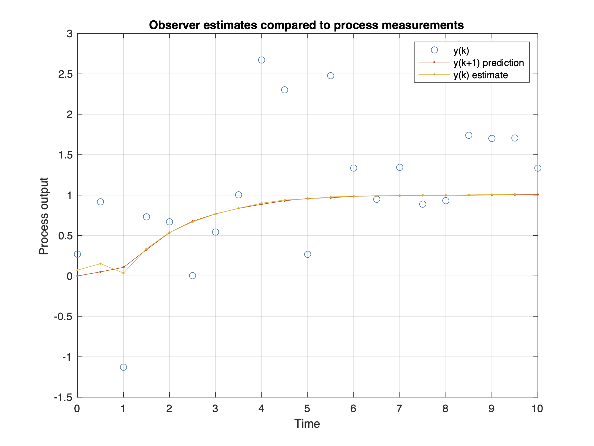

# process-observers

MATLAB scripts for simulating [process observers](https://en.wikipedia.org/wiki/State_observer) for online state estimation, including switching systems, multiple-model observers and specialised observers for estimating the states of processes with *infrequently-occuring*, *abrupt*, *unmeasured disturbances*.

The observers are implemented as MATLAB objects (classes) with similar arguments, properties and methods. They are intended to be used for research purposes to evaluate and compare the behaviour of different multi-model observer algorithms.

For example, the following statement creates a [Kalman filter](https://en.wikipedia.org/wiki/Kalman_filter) object based on a linear model of a dynamical system:

```Matlab
% State-space representation of process model
model.A = 0.7;
model.B = 1;
model.C = 0.3;
model.Ts = 0.5;  % sampling period

% Kalman filter parameters
P0 = 1;  % estimated variance of the initial state estimate
model.Q = 0.01;  % estimated process noise variance
model.R = 0.5^2;  % estimated measurement noise variance

% Kalman filter - prediction form
KF1 = KalmanFilterP(model,P0,'KF1');
```

This object can then be used to iteratively simulate the Kalman filter, given some measurements, `Ym` and known inputs, `U`:

```Matlab
% Array to store estimates
Y_est = nan(nT+1,1);

% Initial estimate (at t=0)
Y_est(1,:) = KF1.ykp1_est;

for i = 1:nT

    % Update observer with measurements at current sample time
    KF1.update(Ym(i), U(i));

    % Get estimate of output at next sample time
    Y_est(i+1,:) = KF1.ykp1_est;

end
```

The internal variables can easily be inspected at any point:
```Matlab
>> KF1

KF1 = 

  KalmanFilterP with properties:

          P0: 1
           K: 0.0162
        Pkp1: 0.0195
           n: 1
          nu: 1
          ny: 1
       model: [1×1 struct]
          Ts: 0.5000
    xkp1_est: 3.3561
    ykp1_est: 1.0068
      xk_est: NaN
      yk_est: NaN
       label: "KF1"
          x0: 0
        type: "KFP"

```

The observer objects can also be included in Simulink models using custom blocks provided in the example model file [MKF_example_sim.slx](MKF_example_sim.slx).


## List of contents

Basic observers:
- [LuenbergerFilter.m](LuenbergerFilter.m) - Luenberger observer (with static correction gain) [[2]](#2).
- [KalmanFilterPSS.m](KalmanFilterPSS.m) - steady-state Kalman filter [[1]](#1) (with static correction gain) - prediction form.
- [KalmanFilterFSS.m](KalmanFilterFSS.m) - steady-state Kalman filter (with static correction gain) - filtering form.
- [KalmanFilterP.m](KalmanFilterP.m) - Kalman filter - prediction form.
- [KalmanFilterF.m](KalmanFilterF.m) - Kalman filter - filtering form.

Observers with switching system models:
- [SKFObserver.m](SKFObserver.m) - Kalman filter with a switching linear model.
- [SKFObserverS.m](SKFObserverS.m) - Kalman filter with a switching linear model and a pre-determined mode sequence.

General multi-model observers:
- [MKFObserver.m](MKFObserver.m) - multi-model Kalman filter observer.
- [MKFObserverS.m](MKFObserverS.m) - multi-model Kalman filter observer with a pre-determined mode sequence.
- [MKFObserverGPB1.m](MKFObserverGPB1.m) - sub-optimal multi-model observer using the first-order generalised pseudo-Bayesian algorithm. [[5]](#5), [[6]](#6).
- [MKFObserverGPB2.m](MKFObserverGPB2.m) - sub-optimal multi-model observer using the second-order generalised pseudo-Bayesian algorithm. [[5]](#5), [[6]](#6).
- [MKFObserverSF.m](MKFObserverSF.m) - sub-optimal multi-model observer with sequence fusion algorithm.
- [MKFObserverSP.m](MKFObserverSP.m) - sub-optimal multi-model observer with the adaptive forgetting with multiple models algorithm by Andersson (1985) [[4]](#4).

Specialised observers for disturbance estimation:
- [MKFObserverSF_RODD.m](MKFObserverSF_RODD.m) - multi-model observer for state estimation in the presence of *randomly-occurring deterministic disturbances* (RODDs) as described in Robertson et al. [[3]](#3).
- [MKFObserverSF_RODD95.m](MKFObserverSF_RODD95.m) - multi-model observer for state estimation in the presence of *randomly-occurring deterministic disturbances* (RODDs) as described in Robertson and Lee [[8]](#8).
- [MKFObserverSP_RODD.m](MKFObserverSP_RODD.m) - multi-model observer for state estimation in the presence of *infreuently-occurring disturbances* with an adaptive sequence pruning multiple model algorithm described in Eriksson and Isaksson [[4]](#4).

There are also extended Kalman filter (EKF) versions — *these are currently still under development and not fully tested*:
- [EKF_observer.m](EKF_observer.m) - extended Kalman filter for non-linear systems.
- [MEKF_observer.m](MEKF_observer.m) - multi-model extended Kalman filter observer.
- [MEKF_observer_RODD.m](MEKF_observer_RODD.m) - multi-model observer as described in Robertson et al. [[3]](#3).
- [MEKF_observer_AFMM.m](MEKF_observer_AFMM.m) - multi-model observer as described in Eriksson and Isaksson [[4]](#4).

Simulink simulation tools:
- [KalmanFilterP_sfunc.m](KalmanFilterP_sfunc.m) - S-function for dynamic and steady-state Kalman filters in prediction form.
- [KalmanFilterF_sfunc.m](KalmanFilterF_sfunc.m) - S-function for dynamic and steady-state Kalman filters in filtering form.
- [MKFObserver_sfunc.m](MKFObserver_sfunc.m) - general-purpose S-function that works with all observer types.
- [MKF_example_sim.slx](MKF_example_sim.slx) - Simulink model file containing S-function blocks.


## Object hierarchy

<p align="center">
    
</p>


## Installation

Clone this repository to your local machine and either add the root to your MATLAB path or work within the main folder.


## Minimal example

Suppose you have some input-output measurement data from a process:
```Matlab
% Known inputs
U = [     0     0     1     1     1     1     1     1     1     1 ...
          1     1     1     1     1     1     1     1     1     1 ...
          1]';

% Output measurements
Ym =  [    0.2688    0.9169   -1.1294    0.7311    0.6694 ...
           0.0032    0.5431    1.0032    2.6715    2.3024 ...
           0.2674    2.4771    1.3345    0.9487    1.3435 ...
           0.8878    0.9311    1.7401    1.7012    1.7063 ...
           1.3341]';

% Sampling period
Ts = 0.5;
```

And, suppose you know the following linear model is a good representation
of the process dynamics:

```Matlab
% Discrete-time transfer function
Gpd = tf(0.3, [1 -0.7], Ts);

% State-space representation of above process model
model.A = 0.7;
model.B = 1;
model.C = 0.3;
model.Ts = Ts;
[n, nu, ny] = check_model(model);
```

Define two Kalman filters:
```Matlab
% Kalman filter parameters
P0 = 1;  % estimated variance of the initial state estimate
model.Q = 0.01;  % estimated process noise variance
model.R = 0.5^2;  % estimated measurement noise variance

% Kalman filter 1 - prediction form
KF1 = KalmanFilterP(model,P0,'KF1');

% Kalman filter 2 - filtering form
KF2 = KalmanFilterF(model,P0,'KF2');
```

Simulate the observer and record the output estimates:
```Matlab
% Number of sample periods
nT = size(Ym, 1) - 1;
% Arrays to store observer estimates
Xk_est = nan(nT+1, n);
Yk_est = nan(nT+1, 1);
Xkp1_est = nan(nT+1, n);
Ykp1_est = nan(nT+1, 1);

% Save initial estimate (at t=0)
Xkp1_est(1,:) = KF1.xkp1_est';
Ykp1_est(1,:) = KF1.ykp1_est;
for i = 1:nT

    % Update observers with measurements
    KF1.update(Ym(i), U(i));
    KF2.update(Ym(i), U(i));

    % Prediction of states and outputs at next sample time
    Xkp1_est(i+1,:) = KF1.xkp1_est';
    Ykp1_est(i+1,:) = KF1.ykp1_est;

    % Check preedictions are identical
    assert(abs(KF1.xkp1_est - KF2.xkp1_est) < 1e-14)
    assert(abs(KF1.Pkp1 - KF2.Pkp1) < 1e-14)

    % Estimate of states and output at current time
    Xk_est(i,:) = KF2.xk_est;
    Yk_est(i,:) = KF2.yk_est;

end
```

Compare observer estimates to measurement data
```Matlab
figure(1)
t = Ts*(0:nT)';
plot(t,Ym,'o',t,Ykp1_est,'.-',t,Yk_est,'.-')
grid on
xlabel('Time')
ylabel('Process output')
legend('y(k)','y(k+1) prediction','y(k) estimate')
title("Observer estimates compared to process measurements")
```



## Other examples

The following scripts provide more detailed examples of how to use the observers:

- [kalman_example_SISO.mlx](kalman_example_SISO.mlx) - Kalman filter simulation on a simple single-input, single-output system
- [RODD_code_tutorial.mlx](RODD_code_tutorial.mlx) - Kalman filter and multi-model observer examples on a 2x2 multivariable system
- [MMKF_example.m](MMKF_example.m) - Simulates two Kalman filters and two multi-model observers on a SISO system with a RODD input step disturbance and compares the mean-squared estimation errors.

## Help

All the classes in this repository are well documented.  Use MATLAB's help command to view the help text. E.g.:

```Matlab
>> help KalmanFilterP
```


## Testing

A comprehensive set of unit test scripts are included.  You can run all the tests by running the MATLAB `runtests` command from the root directory.

## References

<a id="1">[1]</a> Kalman, R. E. (1960). A New Approach to Linear Filtering and Prediction Problems. Journal of Basic Engineering. 82: 35–45. https://doi.org/10.1115%2F1.3662552.

<a id="2">[2]</a> Luenberger, D., An Introduction to Observers. IEEE Transactions on Automatic Control 1971, 16 (6), 596–602. https://doi.org/10.1109/TAC.1971.1099826.

<a id="3">[3]</a> Robertson, D. G., Kesavan, P., & Lee, J. H. (1995). Detection and estimation of randomly occurring deterministic disturbances. Proceedings of 1995 American Control Conference - ACC 95, 6, 4453–4457. https://doi.org/10.1109/ACC.1995.532779

<a id="4">[4]</a> Eriksson, P.-G., & Isaksson, A. J. (1996). Classification of Infrequent Disturbances. IFAC Proceedings Volumes, 29(1), 6614–6619. https://doi.org/10.1016/S1474-6670(17)58744-3

<a id="5">[5]</a> Jaffer, A. G.; Gupta, S. C. (1971). On Estimation of Discrete Processes under Multiplicative and Additive Noise Conditions. Inf. Sci. (USA) 1971, 3 (3), 267–276.

<a id="6">[6]</a> Buxbaum, P. J.; Haddad, R. A. (1969). Recursive Optimal Estimation for a Class of Non-Gaussian Processes. In Proceedings of the symposium on computer processing in communications; Polytechnic Press: New York, NY, USA, pp 375–399.

<a id="7">[7]</a> Andersson, P. (1985). Adaptive Forgetting in Recursive Identification through Multiple Models†. International Journal of Control, 42 (5), 1175–1193. https://doi.org/10.1080/00207178508933420.

<a id="8">[8]</a> Robertson, D. G.; Lee, J. H. (1998). A Method for the Estimation of Infrequent Abrupt Changes in Nonlinear Systems. Automatica, 34 (2), 261–270. https://doi.org/10.1016/S0005-1098(97)00192-1.
